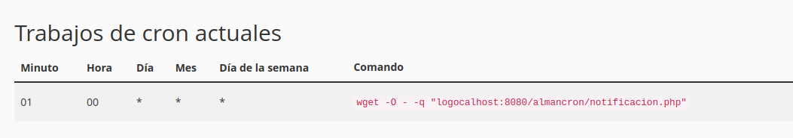

# ALMANCRON

## Es una _pequeña_ aplicacion para generar recordatorios via **Email**.

La misma esta desarrollada con _PHP_ y funciona de la mano de la funcion **CRON** que traen implementado los Hostings.
A su vez, mediante un formulario, se cargan los recordatorios con los siguientes datos:

-MOTIVO
-FECHA
-MENSAJE (_pendiente_)

Estos datos son enviados al backend para ser procesados y cargados en la _Base de datos_ ( MySql ).

### Proceso:

En el formulario se carga el motivo, es decir **el recordatorio** que nos interesa que el sistema nos recuerdo y la fecha en la que queremos que no recuerde, se expesa en _dia_ y _mes_ (01-02) separado por un **-**.
_Proximamente_ integrare un modulo para agregar un texto/mensaj que acompañe el recordatorio.

### CRON JOB

El script que se encarga de enviar las notificaciones via mail es **notificacion.php**, quien verifica la fecha actual y la compara con la fechas cargas en la DDBB, si hay envia el el correo a la direccion cargada en el _script_.
El cron ejecuta el script una vez por dia para hacer la comparacion.
Ejemplo: a las 00:01

### EMAIL

Las notificaciones se envian por email, son enviadas mediante la librerira **PHPMAILER** a la direccion cargada por defual en el archivo **index.php**
